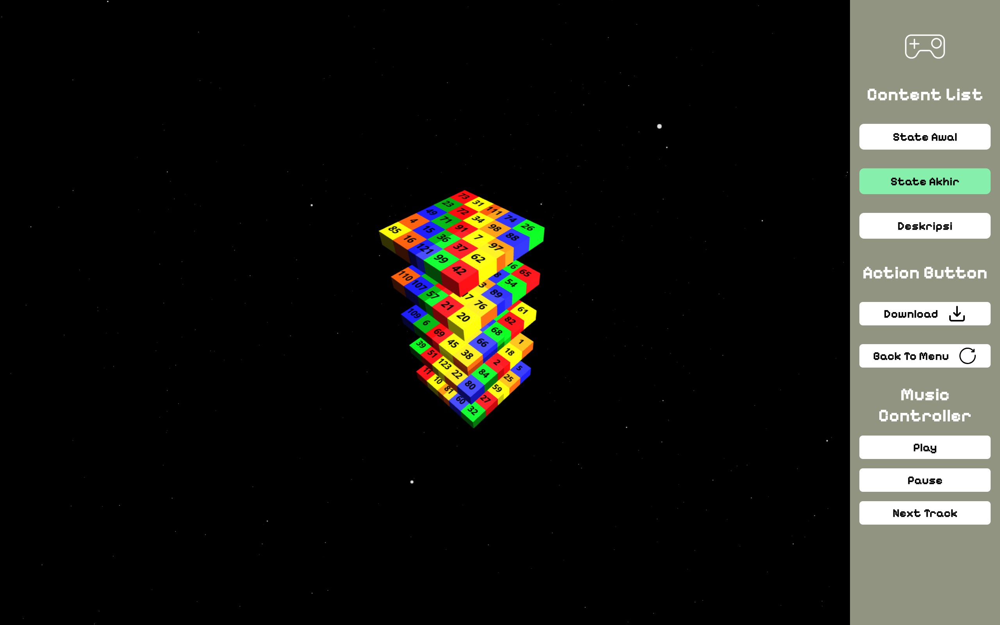

# Solving the Diagonal Magic Cube with a Local Search Algorithm

This project implements a search algorithm to solve the 5x5x5 Diagonal Magic Cube problem using a local search approach. The problem requires that each row, column, pillar, and diagonal within the cube satisfies a constant called the magic number. This project is built as a web application to visualize the solution steps and facilitate analysis.

## List of Algorithms

### 1. **Steepest Ascent Hill-Climbing**
   - The algorithm moves to the neighbor with the highest objective function value.
   - Termination occurs when a local optimum is reached.

### 2. **Hill-Climbing with Sideways Move**
   - Allows steps to neighbors with the same objective function value to overcome flat areas.

### 3. **Random Restart Hill-Climbing**
   - If the solution reaches a dead end, the algorithm restarts randomly and begins the search anew.

### 4. **Simulated Annealing**
   - Uses a probabilistic approach with annealing simulation to avoid getting stuck in local optima.

### 5. **Genetic Algorithm**
   - Utilizes selection, mutation, and crossover to evolve solutions from generation to generation until an optimal solution is reached.

## Technology Used
- Go version 1.22
- Next js


## Getting Started

### Front-End Setup

1. **Install Dependencies**: Open your terminal in the project directory and install the necessary dependencies by running:
   
   ```bash
   npm install
   ```

2. **Start Development Server**: After installation, start the development server with the following command:

   ```bash
   npm run dev
   ```

3. **Access the Application**: Once the server is running, open [http://localhost:3000](http://localhost:3000) in your browser to view the application.

### Back-End Setup

1. **Navigate to API Directory**: Change to the API directory in the backend by running:

   ```bash
   cd src/app/api
   ```

2. **Build the Backend**: Compile the Go code by executing:

   ```bash
   go build
   ```

3. **Run the Backend**: Start the backend server by running:

   ```bash
   go run .
   ```

## How To Use

1. **Run Both Frontend and Backend**: Ensure that both the frontend and backend servers are running by following the setup steps above.

2. **Open the Application**: In your browser, go to [http://localhost:3000](http://localhost:3000).

3. **Choose an Algorithm**: Select the algorithm you want to use from the options provided, and fill in any required fields.

4. **Start and Enjoy**: Click to begin the process and observe the results. Enjoy exploring the functionalities of the application!✨


## Task and Member
| Task                                  | Member                                   |
|---------------------------------------|------------------------------------------|
| Visualization (Front-End)             | 13522157 - Muhammad Davis Adhipramana    |
| Objective Function                    | 13522164 - Valentino Chryslie Triadi     |
| Steepest Ascent Hill-Climbing         | 13522134 - Shabrina Maharani             |
| Hill-Climbing with Sideways Move      | 13522157 - Muhammad Davis Adhipramana    |
| Random Restart Hill-Climbing          | 13522134 - Shabrina Maharani             |
| Stochastic Hill-Climbing              | 13522153 - Muhammad Fauzan Azhim         |
| Simulated Annealing                   | 13522153 - Muhammad Fauzan Azhim         |
| Genetic Algorithm                     | 13522164 - Valentino Chryslie Triadi     |
